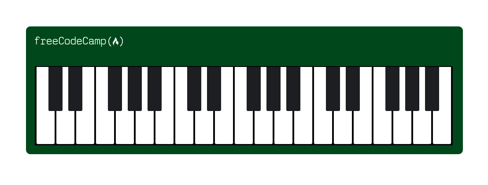
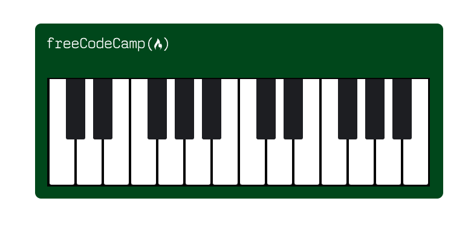
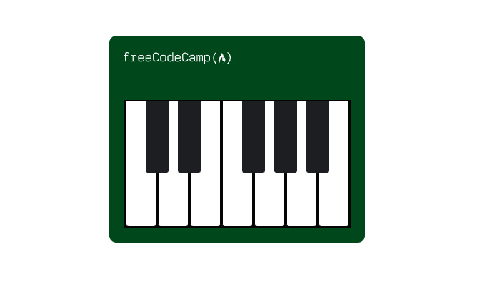

# Learn Responsive Web Design by a Piano

This Repository contains a Piano Project which is made with HTML5 and CSS. This Project is helpfull in learning how to build Responsive sites for different screen sizes.

I learnt this from [freeCodeCamp's](https://www.freeCodeCamp.com) Responsive Web Design Certification Course.

### This is what I made :

#### For Desktop

#### For Tabs

#### For Mobiles

### Live Link :- https://ajitkumarroy.github.io/piano/